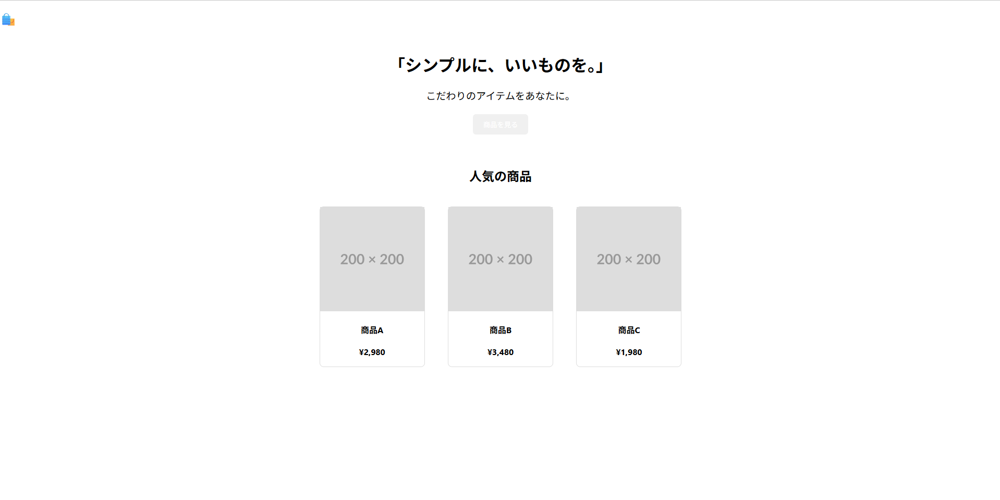

# HTML/CSS課題（資料）

# 準備

配布したZIPファイルを解凍して、研修用フォルダ（例：C:\kenshu）内に配置し、

Live Serverにて起動して画面を確認する。

以下のような画面が出ていたら問題ないです。

# タスク内容

DevToolsで各種プロパティの値を確認しつつ、画面モックを完成させてください。

### ヘッダー

- 背景色は「黒」
- 文字色は「濃いグレー」（カラーコード不問）

### ボディー

- 背景色は楽天市場の背景色と同じ
- 余白は楽天市場のこの部分と同じ

### ヒーロー

- 背景色は白から青へのグラデーション（カラーコード不問）
- ボタンの背景色は楽天の検索ボタンと同じ
- ボタンのホバー時はスケールを1.5倍にする

### メイン

- 各商品の背景色は「白」
- 各商品の影は非選択時は黒、ホバー時は青にすること
- 各商品をホバーした際、5pxほど浮かせること
- 価格の色は「赤」

### 完成イメージ

