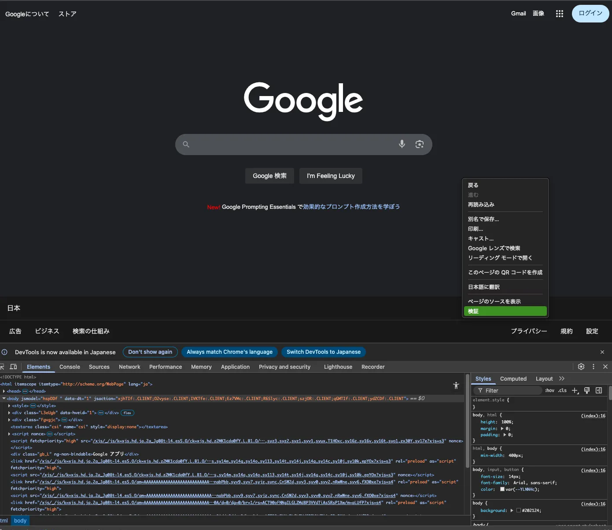
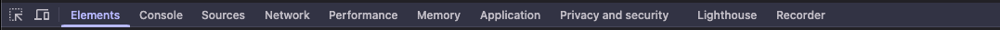

# Chrome開発者モード（DevTools）使い方ガイド

## はじめに

Web開発では必須のツール「Chrome DevTools」の基本操作をまとめた資料です。
HTML/CSSの構造確認、JavaScript/TypeScriptのログ出力やエラー確認を行うには、このツールを使いこなせることが重要になります。

## 1. DevToolsの開き方

| 方法 | 操作 |
| --- | --- |
| ショートカット (Windows)  | `F12` または `Ctrl + Shift + I` |
| ショートカット (Mac) | `Cmd + Option + I` |
| マウス操作 | 任意の要素を右クリック → 「検証」 |

↓開いた時（右クリック→検証で開くことも可能）



※基本はショートカットを使うことをおすすめします。

---

## 2. 各パネルの概要と今回扱う範囲

Chromeの開発者ツールには多くのパネルがあります。



以下は主なパネルの一覧と、今回の資料で解説するパネルです。

| パネル名 | 内容概要 | 今回掲載 |
| --- | --- | --- |
| Inspect | 画面上の要素を直接選択して検証モードに入る | ✅ 解説あり |
| Device Mode | モバイル・タブレットなどの仮想デバイス表示切り替え | ✅ 簡易解説 |
| Elements | HTML構造やCSSスタイルの確認・一時編集 | ✅ 解説あり |
| Console | JavaScript/TypeScript のログ出力、エラー確認、即時実行 | ✅ 解説あり |
| Sources | ブレークポイントを使ったTypeScriptのデバッグ、ファイル構造確認 | ✅ 簡易解説 |
| Network | ページの通信状況（APIリクエストなど）やレスポンスを確認 | ✅ 簡易解説 |
| Performance | ページ描画の速度やパフォーマンスの記録と可視化 | ✅ 簡易解説 |
| Memory | メモリ使用量、メモリリークの追跡 | ✅ 簡易解説 |
| Application | ローカルストレージ、Cookie、Service Workerの確認・操作 | ✅ 簡易解説 |

> 今回の資料では、使用頻度が高い「Elements」「Inspect」「Console」を中心に、それ以外のパネルについても「知っておくと便利」レベルで簡易的に解説を載せています。
さらに詳しく知りたい場合は、公式ドキュメントやチュートリアルなどを参照しながら、実際に手を動かして確認してください。
> 

---

## 3. Inspect（要素の検証）


### ■ 概要

- 選択されたHTMLの要素名、スタイル、イベントリスナーを確認できます。
- ブラウザ上の任意の要素をクリックすると、該当のHTML構造（Elementsタブ）へ自動でジャンプします。

### ■ 使い方

1. DevTools左上の四角＋マウスカーソルのアイコンをクリック、または `Ctrl + Shift + C` で起動する。
2. 任意のHTML要素を選択する。（マウスで画面上の要素を選ぶ）
3. 選択した要素に応じて「Elements」タブに自動フォーカスされる。

※この先の詳細は「5. Elements（HTML/CSS構造の確認と編集）」にて解説します。

---

## 4. Device Mode（簡易解説）

### ■ 概要

- スマホやタブレットなど、異なるデバイスでの画面表示を確認したい場合に使う機能です。

### ■ 使い方

- 開発者ツールを開いた状態で、左上のスマホアイコンをクリック（または `Ctrl + Shift + M`）


- 上部に表示されるデバイス一覧から iPhone、iPad、Pixel などを選択


- 解像度や回転（縦・横）も切り替え可能


※その他の特徴としてメディアクエリ（`@media`）の動作確認を行ったりもできますが、今回の資料で詳細は省略します。必要な場面が出てきた際に、都度調べてみてください。

---

## 5. Elements（HTML/CSS構造の確認と編集）


### ■ 概要

- Inspectの続きです。InspectでHTML要素を選択すると、選択した要素がハイライトされた状態でElementsパネルがアクティブになります。
- Elementsパネルでは、HTMLとCSSを自由に操作して、レイアウトやデザインを**リアルタイムで編集**できます。
- 注意点:ここでの変更は一時的なもので、リロードすると元に戻ります。

### ■ HTML要素の編集方法

1. InspectでHTML要素を選択する。
2. アクティブになったHTML要素をダブルクリック（もしくは F2）で編集できます。

### リアルタイム編集例：


↓

ダブルクリックして「編集中」と入力


↓

エンターキー押下

.png)

### ■ スタイル（CSS）の編集方法

1. InspectでHTML要素を選択する。（HTML要素の編集と同様）
2. 右側のパネル「Styles」からスタイルのプロパティ名と値を編集できる。


↑試しに「編集中」の<h1>タグに「background: red;」を追加し、適用した例です。

こんな感じで、好きな箇所に色々なスタイルを試すことができます。

ちなみに…

%201.png)

各CSSプロパティの左側にある「✅」をオフにすることで、**一時的にそのスタイルを無効化**できます。

デザイン検証時に、**特定のスタイルがレイアウトにどう影響しているかを試したいときに便利**です。

ここは、ページを作る際に使いこなせるととても効率良くスタイルが決められるので、ぜひ自分で色々試してみてください。

### ※ここからは知っておくと扱いやすくなる知識をいくつか記載します。

### ■ 数値のCSSプロパティ値はショートカットで細かく調整できる

CSSプロパティ値が数値の場合は、キーボードショートカットを使用すると上手に値を増減できます。

たとえば…

```css
margin-bottom: 16px; 
```

上記のようなスタイルが適用されている場合、プロパティ値16pxを選択状態にして「↑」で17px、「Shift + ↑」で一気に26pxにすることができます。

| キーボードショートカット | 増減値 |
| --- | --- |
| ↑ または ↓ | 1 |
| Alt + ↑ または Alt + ↓ | 0.1 |
| Shift + ↑ または Shift + ↓ | 10 |
| Ctrl + ↑ または Ctrl + ↓ | 100 |

### ■ スタイルの優先順位を確認する

HTML 要素を選択し、右側のパネルでスタイルを確認すると、1 つの要素に対して複数のスタイルが存在しています。

スタイルが複数存在する場合は、CSSの詳細度（優先順位）が高いものから順に上から表示さ
れています。


### ■ スタイルの影響を受けるHTML要素を確認する

StylesパネルからCSSセレクタ部分にカーソルを合わせて見てください。

影響を受けるすべてのHTML要素が画面上に反映されます。

↓セレクタの上にカーソルを合わせた例


### ✅ このセクションのまとめ

| 項目 | ポイント |
| --- | --- |
| HTMLの編集 | ダブルクリック（またはF2）で即編集可能 |
| CSSの編集 | Stylesパネルで直接書き換え。反映は即時だが一時的 |
| 数値の調整 | ↑↓キーとShift/Altで微調整できる |
| スタイル優先度 | 詳細度が高いものが上に適用される |
| 効果確認 | ✅チェックのON/OFFやセレクタのハイライトで検証 |

---

## 6. Console（ログ出力・エラー確認）

### ■ 概要

Consoleパネルでは、JavaScriptやTypeScriptのログ（console.log()など）の確認やエラーの表示、その場でコードを即時実行することができます。

例えばエラーだと、ページを読み込んだ際や動作中に生じたTypeScriptのerrorやwarningなどの細かい情報が、メッセージとしてコンソールに表示されます。

基本的にこのパネルは、開発中の動作確認やバグ調査に使うことが多いです。

### ■ 基本ログの使い方

```tsx
// 例
console.log("テストログ");
```

### ✅ よく使うログ出力

| メソッド | 説明 |
| --- | --- |
| console.log() | 通常のログ出力 |
| console.warn() | 黄色の警告出力 |
| console.error() | 赤色のエラー出力 |
| console.clear() | Consoleログをクリア |

試しに、皆さんが以前実装したExam-lv1を使って順番に見ていきましょう。

### ✅ ステップ1:アプリの初期化ログ

まずはApp.tsxの冒頭（function App()の最初）に、以下のようなログを仕込んでみます。

```tsx
function App() {
  // ページの初回ロード時だけクリアしたいのでuseEffectを使ってマウント時だけ実行する
  useEffect(() => {
    console.log('[App] 不要なログその1');
    console.log('[App] 不要なログその2');
    console.log('[App] 不要なログその3');
    console.clear(); // コンソール初期化。直前まで書いた不要なログは全てクリアされるので表示されない想定
		console.error('[App] 初期化完了');  // errorログの見た目を確認するためにここに仕込んでいます。
  }, []);
  // useEffect使わないと状態更新時に毎回クリアされる場合がある

  return (
	  // 以下省略
  );
}
```

この状態でアプリを起動し、ブラウザのConsoleパネルに表示されたログを確認しましょう。


**起動直後に**書いてあった `[App] 不要なログその1` 〜 `[App] 不要なログその3` は`console.clear()` の影響で一瞬で消え、結果として `[App] 初期化完了` という赤色のログだけが表示されていることを確認できればOKです。

`console.clear()` を使うと、それまでに出ていた不要なログをすべてクリアし、**必要なログだけを見やすく整理**できます。

デバッグ中にログが多すぎるときは、`clear()` でリセットしておくと見やすく整理できます。

### ✅ ステップ2:Exam1（入力ログを追跡）

試験1では、テキストボックスに値を入力するとその下に同じ内容がリアルタイムで出力される実装をしたと思います。

ここでは、**入力された値がどのように状態として保持され、コンポーネントをまたいで渡されているかをConsoleで確認**してみましょう。

まずは順番にログを仕込んでいきます。

1️⃣ **入力イベントで値を確認するログ**

```tsx
// 例
const handleChange = (e) => {
  const newValue = e.target.value;
  console.log(`[Exam1] 入力値 = ${newValue}`);
  setName(newValue);
};
```

テキストボックスに文字を入力するたびに、`console.log()`で入力値が表示されます。

2️⃣ **TextCopyComponentで値が反映されたことを確認するログ**

```tsx
const TextCopyComponent: React.FC<TextCopyProps> = ({ name }) => {
  // 状態が変わった時だけログ出したいのでuseEffect使用
  useEffect(() => {
    console.warn(`[TextCopyComponent] nameが更新: ${name}`);
  }, [name]);
  
  return (
    <Typography variant="h5" component="div">
      {name}
    </Typography>
  );
};
```

入力値がprops経由で子コンポーネントに渡ると、`console.warn` で「いつ渡ったか」が黄色のログで表示されます。

仕込みが終わったので、実際に入力していきましょう。

最初に、テキストボックスに `a` と入力すると


このような形で出力されます。

さらに `b`、`c` と入力すると…


このように、

- Exam1側の[Exam1] 入力値 = ... ログ
- TextCopyComponent 側の [TextCopyComponent] nameが更新: ... ログ

が、1文字入力するたびにセットで表示されていくのが確認できます。

### 📝 補足

もし `useEffect` を使わずに子コンポーネントの本体に `console.warn()` を直書きしていた場合は、**ReactのStrictModeで2回レンダリングされるため、ログが2回出る**ことがあります。

実際の本番ビルドではStrictModeの二重レンダリングは行われないので、開発時の「無限ループ」「副作用バグ」を検知するための仕様ということも覚えておきましょう。

 

### ✅ ステップ3: Exam2（カウントアップ・ダウンのログ確認）

試験2では、カウントアップ・カウントダウン・リセットを**ボタン操作でできる機能を実装したと思います。**

ここでは、その状態の変化をConsoleでも見られるようにしてみましょう。

今回のログは、カウントアップなどの処理を実際にする時に仕込みます。

```tsx
// 例
const CounterComponent = () => {
  const [count, setCount] = useState(0);

  const handleIncrement = () => {
    setCount(prev => {
      const newVal = prev + 1;
      console.log(`[CounterComponent] +1 → ${newVal}`);
      return newVal;
    });
  };

  const handleDecrement = () => {
    setCount(prev => {
      const newVal = prev - 1;
      console.log(`[CounterComponent] -1 → ${newVal}`);
      return newVal;
    });
  };

  const handleReset = () => {
    console.warn('[CounterComponent] リセット → 0');
    setCount(0);
  };
```

仕込みが終わったので、実際に動かしていきます。

まずはカウントアップです。

「増やす」ボタンを2回クリックすると、


このように、`count` が 0 → 1 → 2 と増えるたびに、`[CounterComponent] +1 → 1` →`[CounterComponent] +1 → 2` のように表示されることが確認できます。

次に「減らす」ボタンを2回クリックすると、


このように、`count` が 2 → 1 → 0 と減るたびに、

`[CounterComponent] -1 → 1` →`[CounterComponent] -1 → 0` のように表示されることが確認できます。

最後に「リセット」ボタンをクリックすると、


↓


`count` が 0 で固定され、リセットのwarnログが表示されればOKです。

### 📝 補足

実務でも `console.log()` に「どう変わったか」「どこで変わったか」を残しておくと、状態が意図しない値になったときに原因を追いやすいので上手く活用していきましょう。

また、consoleにはもっと色々なメソッドがあります。

例えばその中で、`console.table()`というものがあります。

console.log()に比べると使う頻度は少ないかもしれませんが、これを使うと配列やオブジェクトの状態もテーブル形式で可視化できます。

次のステップで、使い方を記載します。

### ✅ **ステップ4: Exam3（配列の追加とmap処理の確認）**

試験3では、**「メンバーを追加」ボタンをクリックするたびに**配列に新しいオブジェクト（ユーザー）が追加され、画面の一覧に反映される実装をしたと思います。

ここでは、

- 配列に正しく追加されているか
- `map` でちゃんと描画されているか

この2点を、Consoleログを使って追跡してみましょう。

今回のログは、ボタンを押したときに新しく追加するタイミングで仕込みます。

```tsx
// 例
const [users, setUsers] = useState([
  { name: '山田', email: 'yamada@yamada.com' },
  { name: '鈴木', email: 'suzuki@suzuki.com' },
]);

useEffect(() => {
  console.table(users);
}, [users]);

const handleAddMember = () => {
  const newUser = { name: '斎藤 輝幸', email: 'saito@saito.com' };
  console.log('[Exam3] メンバー追加:', newUser);
  setUsers([...users, newUser]);
};
```

仕込みが終わったので、実際に動かしていきます。


↓

「メンバーを追加」ボタン押下


このように、Consoleで追加されたメンバー（オブジェクト）の中身の詳細が確認できます。

console.table()は表形式で見られるので、配列やオブジェクトの中身が今回の課題だとわかりやすく確認できます。

### ✅ このセクションのまとめ

Consoleパネルを使いこなすと、**「値がどう流れているか」「どのタイミングで状態が変わっているか」**をブラウザ上ですぐに確認できるので、デバッグ力が一気に上がります。

今後もアプリの挙動がおかしいときは、まずはConsoleにログを仕込んで原因を一歩ずつ切り分けてみましょう！

最後に、ここまでの内容について簡単に表でまとめます。

| ステップ | 目的 | ログ例 | 注目ポイント |
| --- | --- | --- | --- |
| 1. 初期化ログ | `useEffect` で初回だけ実行 | `console.clear()` + `console.error()` | 初期ログを整理しつつエラー表示の確認 |
| 2. 入力値の追跡 | 入力イベント＆props更新 | `console.log()` / `console.warn()` | コンポーネント間の値の流れ |
| 3. カウントアップ/ダウン | 状態変化のログ可視化 | `+1`, `-1`, `リセット` | 計算処理の確認と異常検知(リセットのwarn) |
| 4. 配列追加とmapの追跡 | 配列の状態＆描画確認 | `console.log()` / `console.table()` | 配列変化・一覧表示のチェック |

### 📝 補足

実務でConsoleを使う際のポイントは以下です。

場合にもよるとは思いますが、参考にしてください。

- **ログにラベルをつける**
    
    `[Exam1]` `[CounterComponent]` のようにどこからのログかを明記する。
    
- **本番ではログを残さない**
    
    開発用のログはビルド時に削除するか、環境変数で出さないようにする。
    
- **Debugで使いすぎない**
    
    ログが多すぎると逆に何が重要かわかりにくくなるので、必要な部分だけ残す。
    

---

## 7. Sources（簡易解説）

### ■ 概要

Sourcesパネルでは、ブラウザに読み込まれた**HTML/CSS/JavaScript/TypeScript**のファイル構造を確認したり、**実際のソースコードにブレークポイントを置いてデバッグすることができます**。

※このパネルで反映された変更内容は、他と同様でページをリロードすると破棄されるので注意してください。


今回は試験2(Exam2)の処理を使って、ブレークポイントの基本的な流れだけを押さえておきましょう。

### ✅ Exam2のカウントアップを例にブレークポイント

### 1️⃣ どこに止める？

試験2の`CounterComponent`に、カウントを+1する処理があります。

```tsx
const handleIncrement = () => {
  setCount(prev => {
    const newVal = prev + 1;
    console.log(`[CounterComponent] +1 → ${newVal}`);
    return newVal;
  });
};
```


↓

このconsole.log()の行(101行目)をクリックしてブレークポイントをおきます。

%202.png)

### 2️⃣ 実行してみる

「増やす」ボタンをクリックすると、

ページの処理が `console.log()` の行で一時停止します。


### 3️⃣ 変数を確認する

Sourcesパネルの左側にある**Scope**で

- `prev` がどの値になっているか
- `newVal` が期待通りか

をその場で確認できます。

.png)

この例では、`newVal` が「1」、`prev` が「0」になっています。

ブレークポイントを貼った101行目の時点では、100行目で `newVal` に `prev + 1` が代入されたばかりなので、`newVal` は「1」、`prev` はまだ「0」のまま。

**この状態になっていれば、期待通りです。**

### 4️⃣ ステップ実行で追う

Scopeで変数の値を確認したら、次は**ステップ実行**を使って**処理がどう進むかを追ってみましょう。**

Sourcesパネルの右上（ブレークポイントで止まったときに表示されます）に以下のような操作ボタンがあります。


左から順番に詳細を記載しますが、一気に覚えるのは大変だと思います。

とりあえずステップオーバーを使えるようになるだけでもかなり効率が上がるので、使い慣れてきたら他のも試してみてください。

### Resume script execution （続行）

- 役割：現在の停止位置から **次のブレークポイントまで一気に進める**
- いつ使う？：同じ関数内の確認は終わったけど、次の条件分岐など別の場所で止めたいとき。

### Step over next function call （ステップオーバー）

- 役割：**現在の行を1行だけ実行して、次の行で止める**
- 特徴：関数呼び出しがあっても、**中には入らずに外側で止まる**
- いつ使う？：外枠の処理を順に確認したいとき。

### Step into next function call （ステップイン）

- 役割：**関数呼び出しの中まで入って、内部の処理を追う**
- いつ使う？：呼び出している関数の中でどんな値が作られているか詳しく見たいとき。

### Step out of current function （ステップアウト）

- 役割：**現在の関数の残りを一気に実行して抜ける**
- いつ使う？：関数内部の確認は終わったので、呼び出し元に戻りたいとき。

### ■ 処理を一つずつ追うときの流れ

実際にステップオーバーと実行を使って実行してみましょう。

一旦先ほどまでの実行は消して、最初の状態に戻します。

戻したら、100行目と101行目にブレークポイントを置きます。


この状態で『増やす』ボタンを押すと処理が実行され、100行目で処理が止まります。


ここでScopeを確認し、`prev` が「0」で`newVal` はまだ `undefined`（代入前）になっていればOKです。

確認できたら、ステップオーバーを1回押します。

.png)

押すと、以下が確認できます。

- `const newVal = prev + 1;` が実行されます。
- Scopeで `newVal` が「1」に変わったか確認してください。
- `prev` は変わらず「0」のままです。
- 101行目に進みますがこの時点では`console.log()` は実行されていないのでConsoleパネルには何も出ません。


確認できたら、もう1回ステップオーバーを押してみましょう。

押すと、以下のようになります。


確認できること

- `console.log(`[CounterComponent] +1 → ${newVal}`)` が実行される
- このタイミングで **初めて Console にログが表示される**
    
    → `[CounterComponent] +1 → 1`
    

確認できたら、最後にもう1つ確認します。

ただし今回は、ステップオーバーで1行ずつ見て`return newVal;` を実行しても、その後の `{}` で止まっても特にわかりやすい変化がありません。

なので最後は **「もう確認するものないから一気に進めたい」ということで、**実行を押してみましょう。

.png)

↓


確認できること

- 画面のカウントが「1」に変わっている
    
    → `setCount` に `newVal` が渡り、状態が更新されたことがわかる。
    
- Consoleに追加のログが無いことを確認
    
    → 余計なログが出ていなければ、処理の流れは想定通り。
    

これで「計算 → ログ出力 → 状態更新 → 画面反映」までの流れがScopeとConsoleで一致していることを確認できました。

### ✅ このセクションのまとめ

- Sourcesパネルは「処理を一時停止 → Scopeで変数確認 → ステップ実行」の流れで確認。
- Consoleログと組み合わせて「値の変化」を確認すると理解が早いです。どのタイミングで値が変わるかを確認するだけでも**バグの原因をピンポイントで発見**できます。
- 小さな関数ならStep Overだけで十分追えますし、複雑なコードでもブレークポイントを増やすだけで「条件分岐のどっちを通ってる？」などもすぐわかります。

今回は最低限の使い方を解説しましたが、Sourcesパネルの基本は「止める → Scope を見る → 一歩進める」の繰り返しだけです。

慣れないうちは少し面倒に感じるかもしれませんが、**console.log()だけで調査するより何倍も効率的**です。

> 💡 もっと詳しく知りたい人へ
DevToolsのステップ実行には**Watch（変数の監視）や Call Stack（呼び出し履歴）など、さらに便利な機能がたくさん**あります。
最初は無理に全部覚えなくてOKなので、**「もっと詳しくデバッグしてみたい」と思ったら**ぜひ自分で色々と試してみてください！
> 

---

## 8.Network（簡易解説）

### ■ 概要

Networkパネルでは、ブラウザがサーバーとどんな通信をしているかを**リアルタイムで確認できる**パネルです。

- ページ読み込み時のHTML/CSS/JavaScriptやTypeScriptの取得
- 画像・フォント・外部リソース
- API通信（`fetch` や `XHR`）

など、全部ここに流れてきます。

今回は皆さん研修でAPIについて学んだ後だと思うので、その時のお天気課題を使ってNetworkパネルの見方を解説していきます。

**`fetch` を使って外部API（OpenWeatherMap）から天気情報を取得する**実装をしたと思いますが、Networkパネルでは実際にどんな通信が行われているかを確認できます。

### ■ どこを見る？

APIを扱うときに最低限チェックしたいポイントは以下です。

### 1️⃣ **フィルタ（Fetch/XHR）**

Networkパネルを開いたら、上部の「Fetch/XHR」ボタンをクリックして、**API通信だけを絞り込み表示**します。


↓


### 2️⃣ **Status（ステータスコード）**

通信が成功したかどうかは `Status` 列で確認します。

- `200` → 正常に通信成功
- `401` → 認証エラー（APIキー無効など）
- `404` → URLの間違い
- `500` → サーバー内部エラー

### 3️⃣ **Headersタブ**

リクエストを1つクリックすると右側に詳細が表示されます。

%203.png)

↓


- **General**
    
    → どのURLにアクセスしたか、メソッド（GET/POST）など。
    
- **Request Headers**
    
    → 送信時に含めたAPIキーやパラメータ。
    
- **Query String Parameters**
    
    → URLの `?id=xxx` の部分で送っている地域IDなどが確認できます。
    

### 4️⃣ **Responseタブ**

APIから返ってきたJSONを確認できます。


### ✅ このセクションのまとめ

Networkパネルは最初は情報が多くて難しそうに見えますが、

**最低限「Fetch/XHR」「Status」「Headers」「Response」の4つだけ押さえればOKです。**

> 💡 さらに詳しく知りたい人へ
> 
> 
> Networkパネルには他にもタイムライン表示やキャッシュ制御など便利な機能があります。
> 
> もっと使いこなしたい人は「Chrome DevTools Network API debug」などで検索して実際に色々触ってみてください！
> 

---

## 9. Performance（簡易解説）

### ■ 概要

Performanceパネルは、ページの読み込みや描画の処理速度を記録・可視化できるパネルです。

主に「ページが重い」「動作がカクつく」といったときに、どの処理がボトルネックになっているかを調べるのに使います。

今回はまたExam-lv1を使って、実際に記録してみましょう。

### 1️⃣ **記録の開始と停止**

まず最初に、Performanceパネルを開きます。


開いたら、左上のRecordボタンを押すと計測が開始されます。


↓押してこの状態になったら計測が始まっているので、ページをリロードしたり操作を行なってください。


一通り操作したら、右下のStopで計測を終了できます。

↓Stop押下後、しばらく待つと計測結果がグラフで出力されます。


### 2️⃣ **確認ポイント**

Performanceパネルで計測が終わると、タイムライン形式のグラフが表示されます。

最初は情報量が多くて難しく見えますが、最低限以下の部分を押さえればOKです。

### 1.タイムライン上部（Screenshots / CPU使用量）


この部分はCPU使用率の推移を表しています。

↓のように山が大きい時がありますが、これが処理が重い部分になります。


ちなみにグラフの上の「Screenshots」がONなら、ページの見た目がどう変わったかも時間軸で追えます。


↓


これも表示しておくと、どの操作で描画が止まったのか、遅くなったのかが視覚的にわかります。

### 2.Frames（フレーム描画の安定性）


ここに **緑 / 黄 / 赤** / 白のブロックが表示されます。

- **緑**：問題なし（1フレーム16ms以内で処理できている = 60FPS）
- **黄**：注意（16ms超だが32ms以内 = 30〜60FPS相当。負荷がかかり始めている）
- **赤**：危険（32ms超 = 30FPS以下。カクつきが発生するレベル）
- 白：未計測（特に大きな処理がなく、フレームごとの計測対象がない状態）

今回はシンプルな課題を使用しているので、ブロックは基本白いままで致命的なフレーム落ちはありません。

普通のWebページであればここは軽く見る程度でOKです。

ただし、開発するのがゲームだったり、アニメーションが多い（重視している）Webページやアプリの場合は、このFramesの色をしっかり確認しておく必要があります。

### 3.Summary（処理時間の内訳）


下部の方にある**Summaryタブ**には、処理の内訳が色分けで表示されます。

- **Loading（紫）**：リソースの読み込み
- **Scripting（黄）**：JavaScript / TypeScriptの実行
- **Rendering / Painting（緑 / 青）**：描画処理
- **System / Idle（灰色）**：その他の処理や待機時間

これを見れば「時間がどこで消費されているか」が一目でわかります。

例えばJavaScript / TypeScriptの処理が重ければ黄色、描画が重ければ緑 / 青が大きくなることがわかります。

### ✅ このセクションのまとめ

Performanceパネルは最初は情報が多くて難しそうに見えますが、

**最低限「CPUグラフ」「Frames」「Summary」の3つだけ押さえればOKです。**

- **CPUグラフ** → どの操作で処理が重くなったかを確認
- **Frames** → 緑ならOK、黄は注意、赤は改善必須
- **Summary** → 時間が「読み込み・スクリプト・描画」のどこで消費されているかを把握

> 💡 さらに詳しく知りたい人へ
Performanceパネルには他にも「Call Tree」「Bottom-Up」「Event log」など詳細な分析機能がまだまだあります。
これらを使えば「関数単位でどこに時間を使っているか」まで追えますが、最初のうちは無理に覚えなくて大丈夫です。
今は**「処理が重いときにどこを見ればよいか」を理解しておくことを意識しつつ、ある程度使い慣れてきたら調べてみてください！**
> 

---

## 10.Memory（簡易解説）

### ■ 概要

Memoryパネルは、**ページやアプリがどれくらいメモリを消費しているか**を確認できるツールです。

普段の研修課題（React + TypeScript）で常に使うことは少ないですが、以下のような時に役立ちます。

- ページを長時間開きっぱなしにすると動作が重くなる
- 「戻る」「遷移」を繰り返すとメモリがどんどん増える
- データを消したはずなのに残り続けている（いわゆる **メモリリーク**）

今回は、**Heap snapshot（ヒープスナップショット）**という機能で見てみましょう。


### **Heap snapshot（ヒープスナップショット）**

- その瞬間のメモリ使用量を丸ごと撮影して確認できる機能です。
- どのオブジェクトや配列がどのくらいメモリを食っているかを一覧できます。
- 例えば、配列やコンポーネントが増え続けているのに消えていない場合、「解放されていない」ことが分かります。


↓


ここから「どのオブジェクトがメモリをどれだけ消費しているか」を確認できます。

## ✅ 見るべきポイント

### 1️⃣ Constructor（オブジェクトの種類）

左側のツリーに並んでいるのが「どんな種類のオブジェクトが、いくつ作られているか」の一覧です。

- `Function` → JavaScript/TypeScript の関数オブジェクト
- `Array` → 配列（Stateやリストデータ）
- `Object` → 一般的なオブジェクト
- `string` → 文字列
- Reactの場合は `Fragment` や `Children` など、フレームワーク由来のものも見えます。

ここが異常に多い場合、「オブジェクトを作りすぎてないか？」を疑うヒントになります。

### 2️⃣ Shallow Size / Retained Size

右側の数値がメモリ調査で大事な部分です。

- **Shallow Size（浅いサイズ）**
    
    → そのオブジェクト自体が直接消費しているメモリ量
    
- **Retained Size（保持サイズ）**
    
    → そのオブジェクトが参照を持っているせいで、他のオブジェクトまで解放されない場合に含めた合計メモリ量
    

Retained Sizeが大きいものは「このオブジェクトが残っているせいで他のメモリも解放されない」可能性があるので要注意です。

**イメージで説明すると…**

- Shallow Size → 「この箱（オブジェクト）自体の大きさ」
- Retained Size → 「この箱が鍵を持っていて、他の箱（関連オブジェクト）も捨てられない状態」

例えば

- 使わなくなった画像を「ゴミ箱に入れた」つもりでも、どこかの配列や変数がまだ参照を持っていると削除されず残ってしまう → Retained Sizeが増える。
- 本来なら解放されるべきものが残っている場合、「メモリリークの可能性あり」と判断できます。

### 3️⃣ 差分を取る（実務でよくやる方法）

実際にメモリリークを疑うときは

1. Snapshot を取る
2. ページで操作して「怪しい挙動（何度もボタンを押す、ページ遷移するなど）」を繰り返す
3. もう一度 Snapshot を取る
4. 「Filter by class」で `Detached` などを検索して、不要に残っているオブジェクトが増えてないかを確認

こうすると「本当は消えるはずなのに残ってる」ものを見つけやすいです。

### ✅ このセクションのまとめ

Memoryパネルは、普段の学習や小規模なアプリ開発では使う場面は少ないです。

ただし、以下の症状が出たらチェックしてみましょう。

- ページを開きっぱなしにするとどんどん重くなる
- ボタンを押すたびに動作が遅くなる
- 不要なオブジェクトやDOM要素が解放されない

---

## 11. Application（簡易解説）

### ■ 概要

Applicationパネルは、ブラウザに保存されているデータを確認できる場所です。

ReactやTypeScriptの研修段階ではほとんど触れることはありませんが、「どこにデータが保存されているかを知っておく」だけでも役立ちます。


### ■ よく使う項目

- **Local Storage / Session Storage**
    
    → `localStorage` や `sessionStorage` に保存されたデータを確認できます。
    
    （例：一時的に入力内容を保存している場合など）
    
- **Cookies**
    
    → ログイン状態を維持するための小さなデータです。
    
    皆さんが普段ブラウザでWebページにアクセスする際に「Cookieを受け入れる」みたいな表示をクリックしたことがあると思いますが、これはサイトにログイン状態やユーザー設定を保持する仕組みになります。
    
    開発では普段あまり触らず、必要なときだけ確認すればOKです。
    

### ✅ このセクションのまとめ

- 研修課題では基本使いませんが、「ブラウザにどんなデータが残っているか」を確認する場所です。
- **Local Storage / Session Storage / Cookies**を軽く見られる程度で十分。
- PWAやオフライン対応を扱うようになったら、**Service Worker / Cache Storage**も確認対象になります。